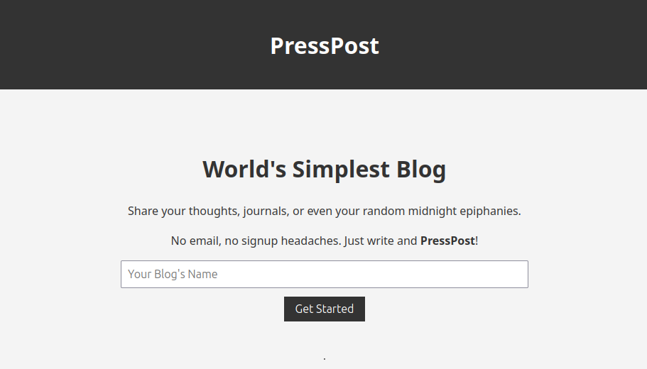
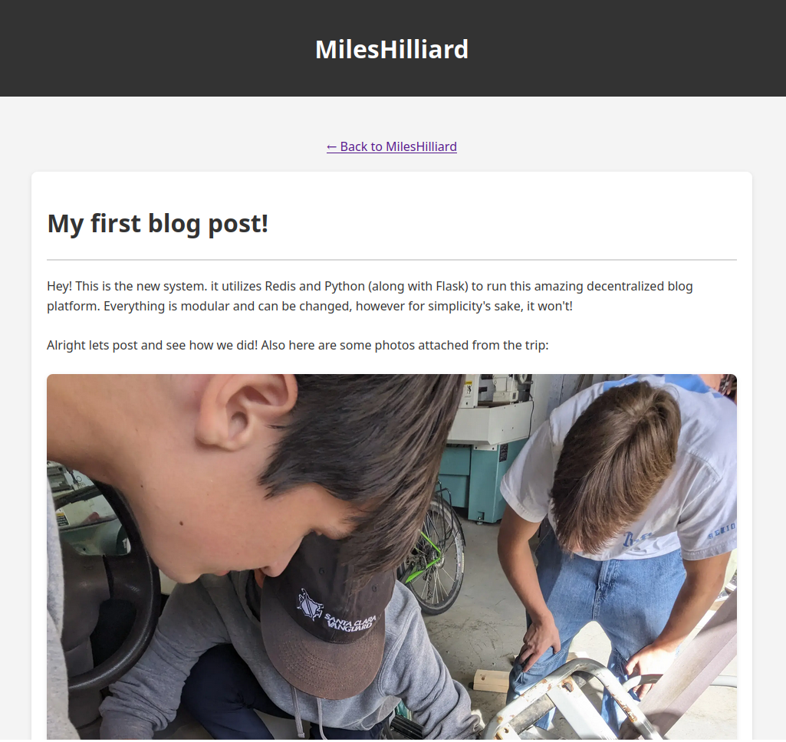

# PressPost

PressPost is a web application that allows users to create their own blog platform. It is a simple and easy-to-use platform that allows users to create their own blog and share their thoughts, journals, and even their random midnight epiphanies.

## Features

* Simple and easy-to-use interface
* Ability to create multiple posts
* Ability to upload images to posts
* Ability to create a password to secure your blog
* Ability to edit and delete posts

# Give it a shot at [presspost.sntx.dev](https://presspost.sntx.dev)

## How to Self-Host

1. Clone the repository using `git clone https://github.com/MilesHilliard/presspost.git`
2. Install the required packages using `pip install -r requirements.txt`
3. Run the application using `python index.py`
4. Open a web browser and navigate to `http://localhost:5000`
5. Create a new blog by clicking on the "Create a Blog" button
6. Enter the name of your blog and click on the "Create Blog" button
7. Enter a password to secure your blog and click on the "Create Blog" button
8. Click on the "Create a Post" button to create a new post
9. Enter the title and content of your post and click on the "Post" button
10. Click on the "Edit Post" button to edit a post
11. Click on the "Delete Post" button to delete a post

## Screenshots

## License

This project is licensed under the MIT License - see the [LICENSE](LICENSE) file for details.
